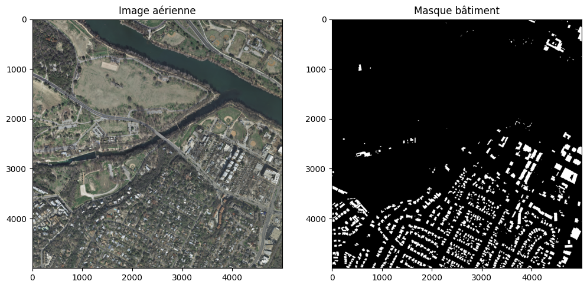
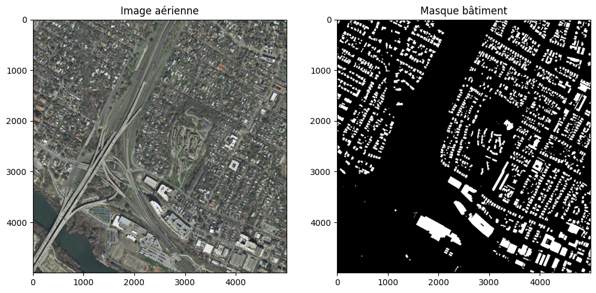
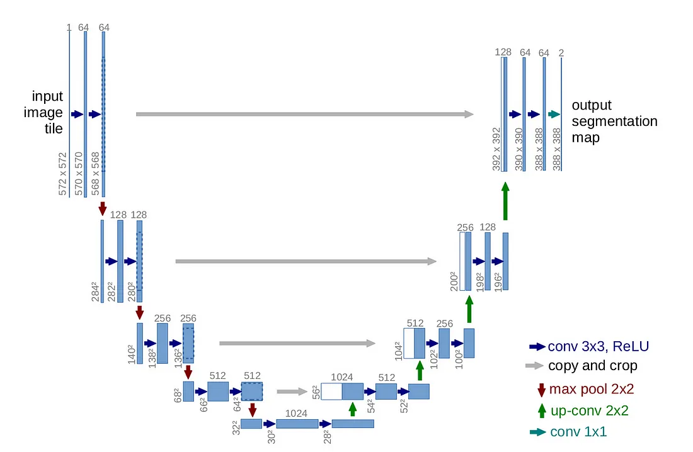
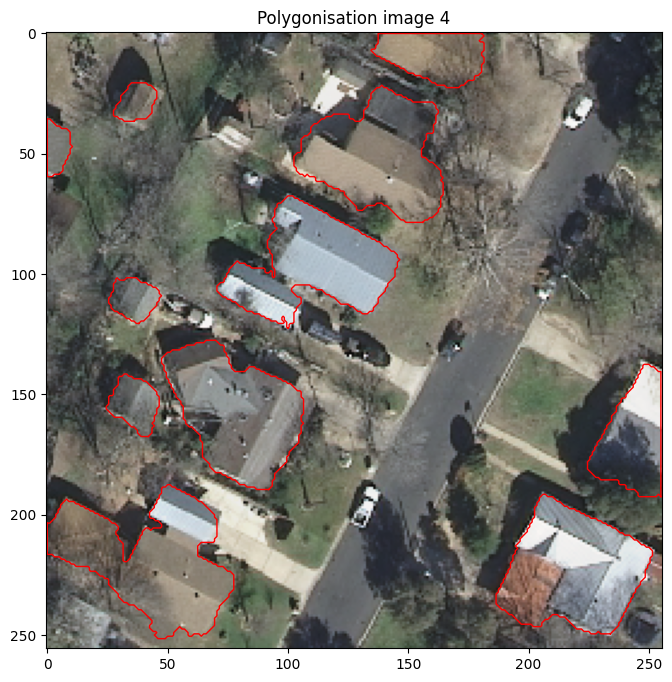
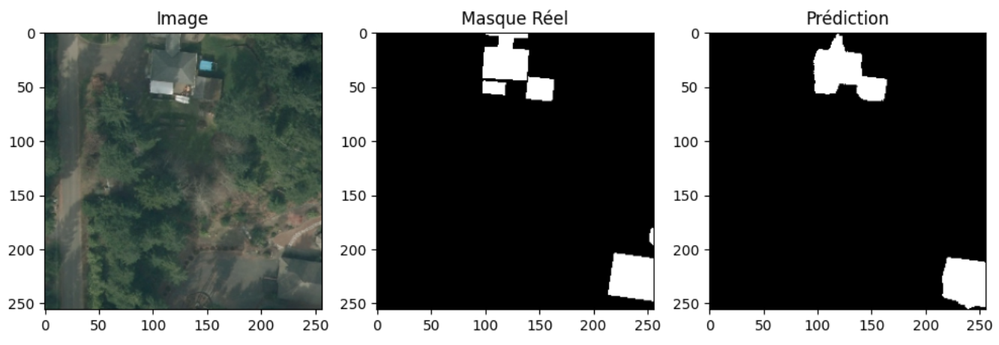
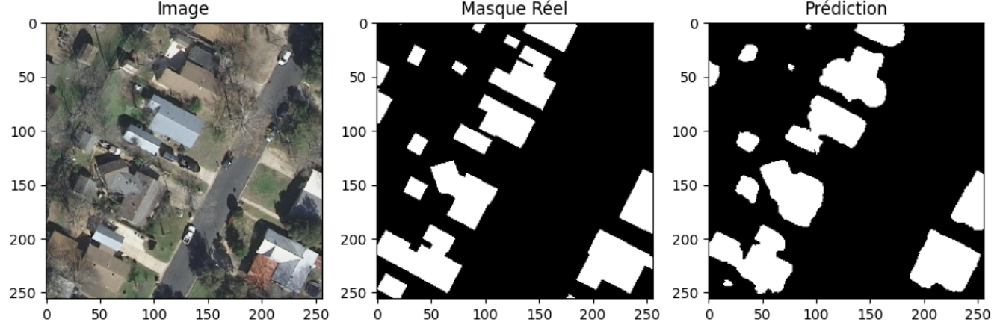

## Objectif du projet

L'objectif de ce projet est de développer un pipeline de traitement d'images aériennes pour détecter automatiquement les bâtiments à partir d'images satellites haute résolution.

Le projet est divisé en deux étapes majeures :
- **Segmentation sémantique** des bâtiments avec un modèle de Deep Learning (U-Net).
- **Polygonisation** des masques prédis afin d'obtenir des contours vectoriels exploitables.

Le travail a été mené dans le cadre du module *Modélisation systèmes vision*.

## Données utilisées

Les données utilisées proviennent du jeu de données public **INRIA Aerial Image Labeling Dataset**.

- Résolution spatiale : 0.3 m/pixel
- Taille des images : 5000x5000 pixels (découpées en sous-patches 256x256 pour l'entraînement)
- 5 villes américaines différentes sont représentées (Austin, Chicago, Kitsap County, Western Tyrol, Vienna)

**Lien vers les données officielles :**  
🔗 [INRIA Aerial Image Labeling Dataset](https://project.inria.fr/aerialimagelabeling/)

Les annotations disponibles sont des masques binaires où les bâtiments sont représentés en blanc.

## Méthodologie

Le projet a été réalisé en plusieurs étapes successives :

### 1. Prétraitement des données

- Découpage des grandes images en sous-patches de 256x256 pixels.
- Sélection des patches contenant des bâtiments pour équilibrer les classes.
- Normalisation des images.

### 2. Data Augmentation

Afin d’augmenter la diversité des données d’apprentissage :
- Rotations aléatoires
- Zoom
- Renversements horizontaux et verticaux

### 3. Modèle de segmentation sémantique

- Architecture utilisée : **U-Net**
- Fonction de perte : combinaison de Dice Loss et Binary Crossentropy, pondérée pour corriger le déséquilibre.
- Optimisation via Adam.

### 4. Post-traitement

- Filtrage des petites zones prédites inférieures à un seuil de surface.
- Extraction des contours et conversion des masques en polygones via les bibliothèques `skimage` et `shapely`:

- Après la segmentation sémantique binaire des bâtiments, un post-traitement de polygonisation est appliqué pour convertir les masques de segmentation en objets vectoriels exploitables.
- Les masques prédits sont d’abord binarisés.
- Puis, les contours sont extraits grâce à la détection de contours.
- Les contours sont transformés en polygones géométriques via la bibliothèque shapely.
- Enfin, les petits objets inférieurs à un seuil de surface sont filtrés pour éviter les faux positifs.

  

### 5. Évaluation des performances

Les performances du modèle sont évaluées à l’aide de plusieurs métriques classiques de segmentation binaire :

- Dice coefficient (F1 Score)
- Intersection over Union (IoU)
- Précision
- Rappel
  

## 6. Contenu du dépôt

- `notebook/` : Notebook complet du pipeline de segmentation et de polygonisation.
- `models/` : Modèle entraîné sauvegardé au format Keras.
- `results/` : Exemples visuels de segmentation et de polygonisation.
- `data/` : (lien — le dataset INRIA est disponible publiquement via le lien indiqué plus haut).
- `requirements.txt` : Liste des dépendances nécessaires pour exécuter le projet.

